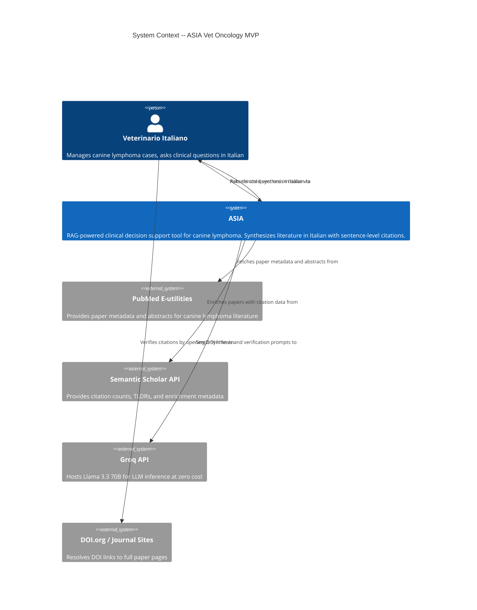
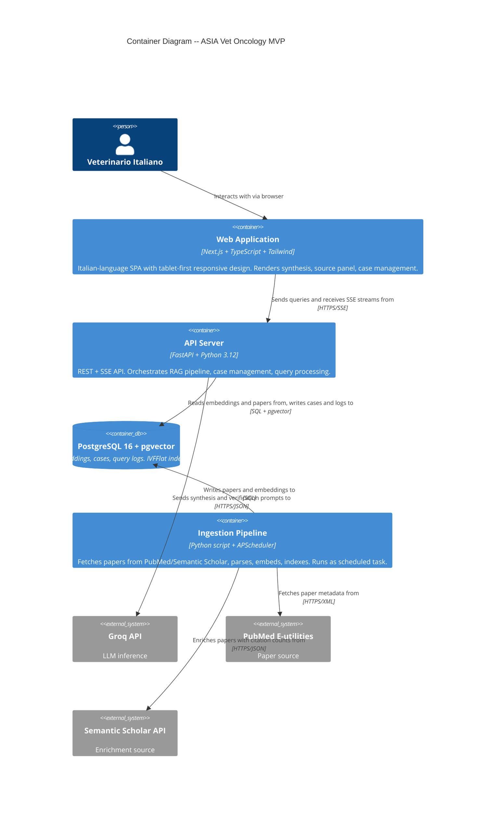
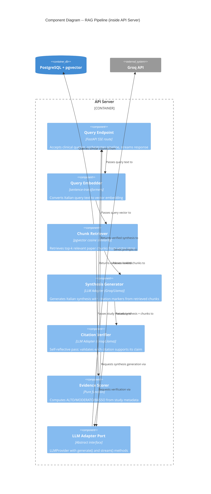

# Architecture Design -- ASIA Vet Oncology MVP

**Feature ID**: asia-vet-oncology
**Wave**: DESIGN
**Architect**: Morgan (Solution Architect)
**Date**: 2026-04-01
**Status**: Draft

---

## 1. System Overview

ASIA is a RAG-powered clinical decision support tool for Italian veterinarians managing canine lymphoma cases. The system ingests scientific literature from PubMed and Semantic Scholar, embeds and indexes it in PostgreSQL with pgvector, and provides an Italian-language synthesis with sentence-level citations via a streaming API.

**Quality attribute priorities** (in order):

1. **Correctness/Safety** -- zero hallucinated citations (kill criterion)
2. **Time-to-market** -- MVP demo-ready in ~10 days
3. **Maintainability** -- open source, one developer must understand everything
4. **Testability** -- every claim verifiable via DOI links

---

## 2. C4 System Context Diagram (L1)



---

## 3. C4 Container Diagram (L2)



---

## 4. C4 Component Diagram -- RAG Pipeline (L3)

The RAG pipeline is the most complex subsystem (5+ internal components) and warrants a component-level diagram.



---

## 5. Self-Reflective RAG Citation Verification (Resolves H1)

### Algorithm Overview

The self-reflective RAG performs a two-phase process: generate then verify. This ensures every citation in the final output genuinely supports its associated claim.

### Phase 1: Generate

**Input**: User query (Italian) + top-k retrieved paper chunks (English abstracts/text with metadata)

**Process**:
1. Embed user query using sentence-transformers
2. Retrieve top-k chunks (k=10 for MVP) via pgvector cosine similarity
3. Send chunks + query to LLM with synthesis prompt (see Section 5.3)
4. LLM produces Italian synthesis with inline citation markers `[1]`, `[2]`, etc.
5. LLM also produces a structured citation-claim mapping: `{citation_id, claim_text, chunk_id}`

**Output**: Draft synthesis + citation-claim mappings

### Phase 2: Verify (Self-Reflective Pass)

**Input**: Each `(claim_text, cited_chunk)` pair from Phase 1

**Process**: For each citation-claim pair, send to LLM with verification prompt:

```
Sei un revisore scientifico. Analizza se il seguente passaggio del paper supporta
effettivamente l'affermazione fatta nella sintesi.

AFFERMAZIONE: "{claim_text}"
PASSAGGIO DEL PAPER: "{chunk_text}"
METADATI: {author}, {year}, {journal}, {study_type}

Rispondi con:
- SUPPORTA: il passaggio conferma direttamente l'affermazione
- PARZIALE: il passaggio e' correlato ma non conferma completamente
- NON_SUPPORTA: il passaggio non supporta l'affermazione

Motivazione (1 frase):
```

**Pass/Fail Criteria**:
- `SUPPORTA` -> citation kept as-is
- `PARZIALE` -> claim text is softened (e.g., "suggests" instead of "demonstrates"), citation kept
- `NON_SUPPORTA` -> citation removed, claim removed or rewritten without the unsupported assertion

**Post-verification**: If any citations were removed or claims modified, the synthesis is regenerated with the remaining verified citations only (single regeneration, not iterative).

### Constraints

- **Max iterations**: 1 generation + 1 verification pass + 1 optional regeneration = 3 LLM calls max for verification
- **Timeout**: 25 seconds total for the entire pipeline (embedding + retrieval + synthesis + verification). If verification exceeds timeout, return the draft synthesis with a note: "Verifica citazioni in corso..." and no transparency note
- **Batch verification**: All citation-claim pairs are verified in a single LLM call (not one per citation) to minimize latency

### Example Walkthrough

1. Vet asks: "Qual e il protocollo di prima linea per linfoma B-cell stadio III?"
2. Retriever returns 10 chunks from papers by Garrett (2002), Simon (2006), Sorenmo (2020), Vail (2013), and 3 others
3. Synthesizer generates: "Il protocollo raccomandato e il CHOP con remissione dell'80-90% [1][2]. CHOP-19 e CHOP-25 hanno outcome equivalenti [3]. Sopravvivenza mediana 10-14 mesi [1][2][4]."
4. Citation-claim mappings: `[1] Garrett -> "80-90% remission"`, `[2] Simon -> "80-90% remission"`, `[3] Sorenmo -> "equivalent outcomes"`, `[4] Vail -> "10-14 months survival"`
5. Verifier checks all 4 pairs in one call. Result: [1] SUPPORTA, [2] SUPPORTA, [3] SUPPORTA, [4] PARZIALE (Vail discusses prognosis by immunophenotype, survival range is inferred not directly stated)
6. Claim for [4] softened to "studi indicano sopravvivenza mediana intorno a 10-14 mesi [1][2][4]"
7. Final synthesis returned with all 4 citations intact, [4] with softened language

### Confidence Threshold

After retrieval, compute a relevance score:
- If max cosine similarity of top-k chunks < 0.35: return "no evidence" response immediately
- If average cosine similarity of top-5 chunks < 0.25: return "no evidence" response
- Otherwise: proceed to synthesis

These thresholds should be calibrated against the 5 critical queries during development.

---

## 6. Error Path Emotional Arcs (Resolves H2)

### E1: No Evidence Found

```
Emotional arc: Curious -> Disappointed -> Guided -> Neutral-Positive

Timeline:
  0s     Vet submits query              (Curious, hopeful)
  2-5s   System searches corpus         (Waiting, expectant)
  5s     "No evidence" message appears  (Disappointed, but not angry)
  5-10s  Vet reads scope explanation     (Understanding -- "ah, it only covers lymphoma")
  10-15s Vet sees suggestions            (Guided -- "I can try PubMed or rephrase")
  15s+   Vet acts on a suggestion        (Neutral-positive -- "honest tool, not a faker")

Key design principle: Disappointment is acceptable if followed immediately by
honest explanation + actionable alternatives. Never leave the vet in a dead end.

UX elements:
  - Empathetic tone: "Non sono state trovate evidenze sufficienti" (not "Errore")
  - Scope explanation: "Il corpus attuale copre il linfoma multicentrico canino"
  - 3 concrete suggestions: rephrase, try pre-loaded, PubMed link
  - PubMed link auto-constructed from query terms
```

### E2: Slow Response (>5s to first token)

```
Emotional arc: Expectant -> Anxious -> Reassured -> Patient

Timeline:
  0s     Vet submits query              (Expectant)
  0-2s   Loading indicator appears       (Normal waiting)
  2-5s   "Analisi in corso..." message   (Starting to wonder)
  5s     Progress indicator activates    (Reassured -- real work happening)
  5-30s  Progress updates: paper count   (Patient -- "12 papers being analyzed")
  30s    Response arrives                (Relief -> Focused on content)

Key design principle: Anxiety comes from uncertainty, not from waiting.
Show what the system is doing. Paper count proves real work.

UX elements:
  - Immediate: spinning indicator + "Analisi della letteratura in corso..."
  - At 5s: paper count appears "Sto analizzando {n} paper rilevanti"
  - At 10s: estimated time "Tempo stimato: ~{s} secondi"
  - Progress updates via SSE heartbeat events
```

### E3: Citation Removed During Self-Reflection

```
Emotional arc: (invisible to vet until result) -> Impressed -> More trusting

Timeline:
  0-25s  Normal synthesis + verification (Vet does not see this)
  25s    Response appears with note      (Reads synthesis, notices note)
  25-30s Reads transparency note          (Impressed -- "it checks itself")
  30s+   Verifies remaining citations     (More trusting than without the note)

Key design principle: Transparency about self-correction builds MORE trust
than hiding it. The note is brief, not alarming.

UX elements:
  - Small info box below synthesis (not modal, not alarming)
  - Text: "Una citazione inizialmente identificata e stata rimossa
    perche non supportava adeguatamente l'affermazione. La sintesi
    riflette solo fonti verificate."
  - Visible but secondary -- the synthesis is the primary content
```

### E4: Streaming Connection Lost

```
Emotional arc: Engaged -> Startled -> Reassured -> Re-engaged

Timeline:
  0-15s  Response streaming normally     (Engaged, reading)
  15s    Connection drops                (Startled -- text stops mid-sentence)
  15-16s Partial response preserved       (Sees what was already received)
  16s    Reconnection message appears    (Reassured -- "La connessione e stata
                                          interrotta. Il contenuto ricevuto e
                                          stato preservato.")
  16-17s Retry button visible             (Has agency -- can retry)
  17s+   Clicks retry or copies content   (Re-engaged)

Key design principle: Never lose content the vet has already read.
Partial information is better than nothing in a clinical context.

UX elements:
  - Partial response stays visible (never cleared)
  - Banner: "Connessione interrotta. Il contenuto parziale e stato preservato."
  - "Riprova" button to resubmit the same query
  - If partial response has citations, source panel still shows those
```

---

## 7. Streaming Performance Specifications (Resolves H3)

| Metric | Target | Measurement Point |
|--------|--------|-------------------|
| First SSE token | <= 3 seconds | From query submission to first `data:` event received by frontend |
| First readable text | <= 5 seconds | From query submission to first complete Italian word rendered |
| Evidence level indicator | Visible before streaming completes | Sent as first SSE event (computed from retrieval metadata, before LLM call) |
| Source panel data | Sent before synthesis text | Source metadata from retrieval, not dependent on LLM generation |
| Final synthesis token | <= 30 seconds | From query submission to `[DONE]` SSE event |
| Source panel fully rendered | <= 32 seconds | Source panel populated from retrieval metadata (available at ~3s) |
| Self-reflection note (if any) | <= 35 seconds | Appended after synthesis completes |

### SSE Event Sequence

```
1. event: metadata    -- evidence level, study count, sample size (from retrieval)
2. event: sources     -- citation details with DOIs (from retrieval metadata)
3. event: token       -- synthesis text tokens (streaming from LLM)
4. event: token       -- ... (continues)
5. event: reflection  -- transparency note if citations were removed
6. event: done        -- signals completion
```

**Rationale**: By sending metadata and sources before the synthesis text, the vet sees the evidence level and source panel while the LLM generates. This creates a perception of speed and allows the vet to start assessing evidence quality immediately.

### Heartbeat Events

```
event: heartbeat     -- sent every 3 seconds during LLM processing
data: {"status": "analyzing", "papers_count": 12}
```

Heartbeats prevent SSE connection timeout and provide progress information for E2 (slow response) handling.

---

## 8. Evidence Level Scoring Algorithm (Resolves M2)

### Formula

```
evidence_score = study_type_score + count_bonus + sample_size_bonus

where:
  study_type_score = max(study_type_weight for each cited study)
  count_bonus = min(study_count, 5) * 2
  sample_size_bonus = floor(log10(total_sample_size + 1)) * 3
```

### Study Type Weights

| Study Type | Weight | Rationale |
|-----------|--------|-----------|
| Meta-analysis / Systematic review | 30 | Highest level of evidence aggregation |
| Randomized controlled trial (RCT) | 25 | Gold standard for intervention studies |
| Prospective multicenter study | 22 | Strong evidence, multiple sites reduce bias |
| Prospective single-center study | 18 | Good evidence, single site |
| Retrospective study | 12 | Common in vet oncology, inherent biases |
| Case series (n >= 5) | 8 | Limited but useful in rare conditions |
| Case report (n < 5) | 4 | Anecdotal, lowest weight |
| Expert opinion / textbook | 2 | Not primary evidence |

### Thresholds

| Level | Italian Label | Score Range | Example |
|-------|--------------|-------------|---------|
| ALTO | "Livello di evidenza: ALTO" | >= 40 | 1 RCT (25) + 3 studies (6) + n=400 (7.8) = 38.8 -> round up |
| MODERATO | "Livello di evidenza: MODERATO" | 20 - 39 | 2 retrospective (12) + 2 studies (4) + n=135 (6.4) = 22.4 |
| BASSO | "Livello di evidenza: BASSO" | < 20 | 1 case series (8) + 1 study (2) + n=15 (3.5) = 13.5 |

### Calibration Notes

- Thresholds must be validated against the 5 critical queries during development
- In veterinary oncology, RCTs are rare. Most evidence will score MODERATO. This is honest and expected.
- The score is displayed alongside the raw metadata (study count, study types, total sample size) so vets can make their own assessment

---

## 9. Case Context Injection Template (Resolves M3)

When a query is made within a case, the following template is used to prepend case context to the RAG prompt:

```
--- CONTESTO PAZIENTE ---
Paziente: {patient_name}
Razza: {breed}
Eta: {age}
Diagnosi: {diagnosis}
Stadio: {stage}
Immunofenotipo: {immunophenotype}
Note cliniche: {notes}
--- FINE CONTESTO ---

Domanda del veterinario: {query_text}

Istruzioni: Utilizza il contesto del paziente per fornire una risposta piu specifica.
Se le informazioni del paziente (razza, eta, stadio, immunofenotipo) sono rilevanti
per la risposta, menzionalo esplicitamente nella sintesi. Se il contesto non
influenza la risposta, rispondi normalmente senza forzare riferimenti al paziente.
```

### Behavior Rules

- Empty optional fields are omitted from the template (not sent as blank)
- The template is prepended to the standard RAG synthesis prompt
- Context injection does NOT affect the embedding/retrieval step (query text alone is embedded)
- Context DOES affect the LLM synthesis step (included in the LLM prompt for more specific generation)
- When no case context exists (homepage query), the template section is omitted entirely

---

## 10. Accessibility Criteria (Resolves M4)

### WCAG 2.1 AA Baseline

| Criterion | Requirement | Implementation Note |
|-----------|-------------|---------------------|
| Color contrast | 4.5:1 minimum for text, 3:1 for large text | Tailwind color palette audit needed |
| Touch targets | 44x44px minimum | All buttons, cards, links |
| Keyboard navigation | All interactive elements focusable and operable | Tab order: search box -> pre-loaded cards -> buttons |
| Screen reader | Semantic HTML, ARIA labels where needed | Source panel toggle, evidence level badge |
| Focus indicators | Visible focus ring on all interactive elements | Tailwind `focus:ring-2` |
| Text scaling | Content readable at 200% zoom | Responsive layout handles this |
| Motion | Respect `prefers-reduced-motion` | Streaming animation can be reduced |
| Language | `lang="it"` on HTML element | Italian interface |

### Evidence Level Accessibility

- ALTO/MODERATO/BASSO must not rely solely on color
- Use text label + optional icon (not color alone)
- Include `aria-label` with full description: "Livello di evidenza moderato basato su 4 studi"

---

## 11. Component Architecture

See `/docs/feature/asia-vet-oncology/design/component-boundaries.md` for full module structure.

### Summary

The system follows a **modular monolith with ports-and-adapters** pattern. A single FastAPI process contains all backend logic, organized into domain modules with clear port boundaries:

- **Query Module**: Orchestrates RAG pipeline (embed -> retrieve -> synthesize -> verify)
- **Ingestion Module**: Fetches, parses, embeds, and indexes papers
- **Case Module**: CRUD for cases and query history
- **LLM Port**: Abstract interface for LLM providers (Groq MVP, swappable)
- **Embedding Port**: Abstract interface for embedding models
- **Paper Repository Port**: Abstract interface for paper/chunk storage

---

## 12. Integration Patterns

### Frontend <-> API Server

- **Protocol**: HTTPS (REST for CRUD, SSE for streaming)
- **Endpoints**:
  - `POST /api/query` -> SSE stream (clinical query)
  - `POST /api/explain-paper` -> SSE stream (paper explanation)
  - `GET /api/pre-loaded-queries` -> JSON (5 queries)
  - `GET /api/corpus-metadata` -> JSON (corpus date, paper count)
  - `POST /api/cases` -> JSON (create case)
  - `GET /api/cases/{id}` -> JSON (case details + query history)
  - `POST /api/cases/{id}/query` -> SSE stream (case-contextualized query)
- **Error format**: `{"error": "message_key", "detail": "Italian message", "suggestions": [...]}`

### API Server <-> Groq API

- **Protocol**: HTTPS/JSON
- **Pattern**: LLM Adapter port isolates this dependency
- **Rate limiting**: Groq free tier allows 30 requests/minute, 6000 tokens/minute. MVP usage: ~3-5 requests per query (synthesis + verification). Well within limits for 1-3 concurrent users.
- **Retry**: Exponential backoff (1s, 2s, 4s) with max 3 retries for transient errors
- **Circuit breaker**: After 5 consecutive failures, fail fast for 30 seconds

### Ingestion Pipeline <-> PubMed / Semantic Scholar

- **Protocol**: HTTPS (XML for PubMed E-utilities, JSON for Semantic Scholar)
- **Rate limiting**: PubMed requires 3 requests/second max (10/s with API key). Semantic Scholar: 100 requests/5 minutes.
- **Pattern**: Batch ingestion, not real-time. APScheduler runs daily or on-demand.

### External Integrations Requiring Contract Tests

```
External Integrations Requiring Contract Tests:
- Groq API (REST/JSON): LLM inference for synthesis and verification
  Recommended: consumer-driven contracts via pact-python in CI acceptance stage
- PubMed E-utilities (REST/XML): Paper metadata and abstract retrieval
  Recommended: consumer-driven contracts via pact-python in CI acceptance stage
- Semantic Scholar API (REST/JSON): Paper enrichment data
  Recommended: consumer-driven contracts via pact-python in CI acceptance stage
```

---

## 13. Deployment Architecture

### Docker Compose (MVP)

```yaml
services:
  frontend:    # Next.js, port 3000
  api:         # FastAPI, port 8000
  db:          # PostgreSQL 16 + pgvector, port 5432
  ingestion:   # Python script (runs on-demand or scheduled)
```

### Hardware Constraints (MacBook Air M1 8GB)

| Service | Estimated Memory | Notes |
|---------|-----------------|-------|
| PostgreSQL + pgvector | ~500MB | With ~2000 papers indexed |
| FastAPI + sentence-transformers | ~1.5GB | all-MiniLM-L6-v2 is ~80MB; larger models may not fit |
| Next.js dev server | ~300MB | Production build is lighter |
| Docker overhead | ~500MB | Docker Desktop for Mac |
| **Total** | **~2.8GB** | Leaves ~5GB for OS and other apps |

### Embedding Model Selection

For 8GB M1:
- **Primary choice**: `all-MiniLM-L6-v2` (80MB, 384 dimensions) -- fits easily, good multilingual performance
- **If quality insufficient**: `paraphrase-multilingual-MiniLM-L12-v2` (420MB, 384 dimensions) -- better cross-lingual (Italian query -> English papers)
- **Avoid**: PubMedBERT or large domain-specific models (2GB+, will not fit alongside PostgreSQL)

---

## 14. Quality Attribute Strategies

### Correctness/Safety (Priority 1)

- Self-reflective RAG citation verification (Section 5)
- Confidence threshold prevents synthesis when evidence is insufficient
- DOI links enable human verification
- "No evidence" response preferred over fabrication
- Kill criterion: any hallucinated citation stops the project

### Time-to-Market (Priority 2)

- Modular monolith: no microservice overhead
- Docker Compose: single `docker compose up`
- Groq free tier: zero setup cost for LLM
- Pre-loaded queries: guaranteed demo quality
- APScheduler not Celery: simpler task scheduling

### Maintainability (Priority 3)

- Ports-and-adapters: swap LLM provider without touching business logic
- Single repository: monorepo with `backend/`, `frontend/`, `docs/`
- Apache 2.0 license: permissive for contributors
- Architecture enforcement via import-linter (Python) and eslint-plugin-boundaries (TypeScript)

### Testability (Priority 4)

- LLM Adapter port: mock LLM responses for deterministic tests
- Embedding port: mock embeddings for fast unit tests
- Paper repository port: in-memory implementation for testing
- 5 critical queries as integration test suite

### Observability (MVP-appropriate)

- **Structured logging**: Python `structlog` (MIT) for JSON-formatted logs
- **RAG pipeline logging**: Every query logs retrieval scores, chunk IDs, verification results, evidence level, response time
- **Ingestion logging**: Papers fetched, duplicates skipped, errors encountered, run duration
- **No external monitoring stack for MVP**: Logs to stdout (Docker Compose captures them). Post-MVP: consider Prometheus + Grafana if needed.
- **Key log events**: `query.received`, `retrieval.completed` (with top-k scores), `synthesis.started`, `verification.result` (per citation), `response.completed` (with total_ms), `error.no_evidence`, `error.llm_failure`

---

## 15. Architectural Enforcement

| Layer | Tool | License | Purpose |
|-------|------|---------|---------|
| Python backend | `import-linter` | BSD-2 | Enforce module dependency rules (domain must not import from adapters) |
| TypeScript frontend | `eslint-plugin-boundaries` | MIT | Enforce component boundary rules |
| Both | `pre-commit` hooks | MIT | Run linting checks before commit |

### import-linter Contract Example

```ini
[importlinter:contract:domain-independence]
name = Domain must not import from adapters
type = forbidden
source_modules =
    asia.domain
forbidden_modules =
    asia.adapters
```

---

## 16. ADR References

All ADRs stored in `/docs/adrs/`:

- **ADR-001**: LLM Adapter Pattern
- **ADR-002**: Self-Reflective RAG Approach
- **ADR-003**: Groq as MVP LLM Provider
- **ADR-004**: Modular Monolith with Ports-and-Adapters
- **ADR-005**: Embedding Model Selection
- **ADR-006**: PostgreSQL + pgvector for Vector Storage
